# SPIxCONV

This project consists of an 18-bit analog input (ADC) and output (DAC) within a range of 20 V (± 10 V) and 32 digital pins that can be either as inputs or outputs. This system interfaces with pulsed power electronics hardware in order to control the output voltage for pulsed magnets as well as read and write status commands to their power supplies. An operator interface (OPI) software based on Qt was also developed for remote control.

<!--========================================-->
## Hardware
<!--========================================-->

<!--==============================-->
### Main Board
<!--==============================-->

<!--====================-->
#### Circuit
<!--====================-->

  - Board

  
   

  - CPLD

  
   

  - DAC

  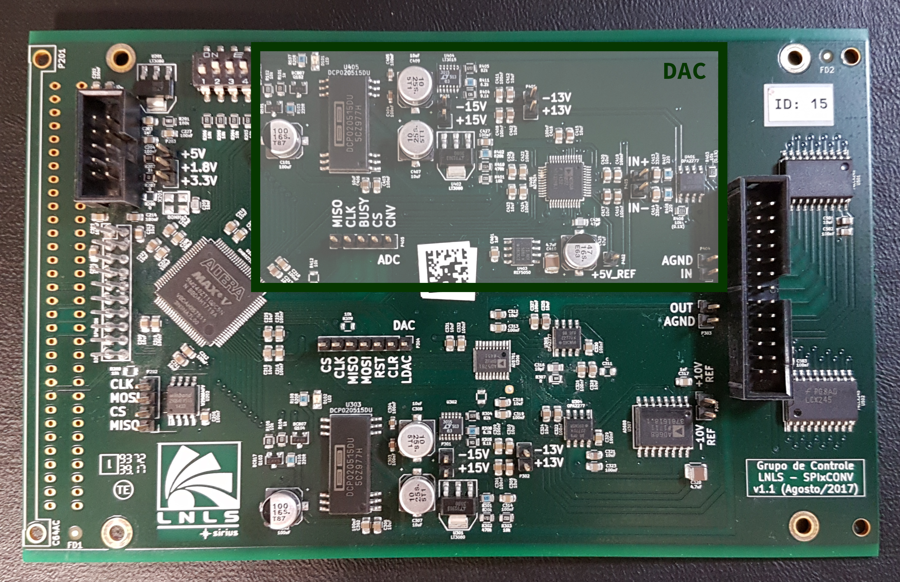
   

  - ADC

  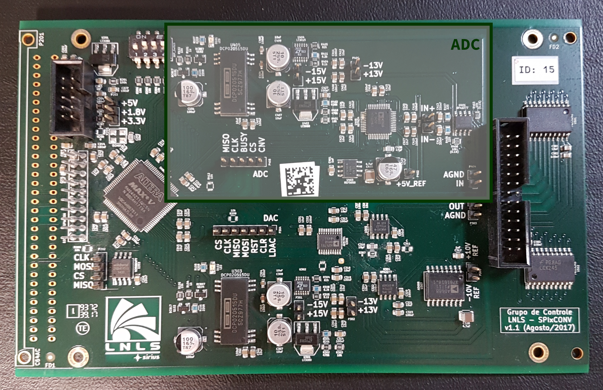
  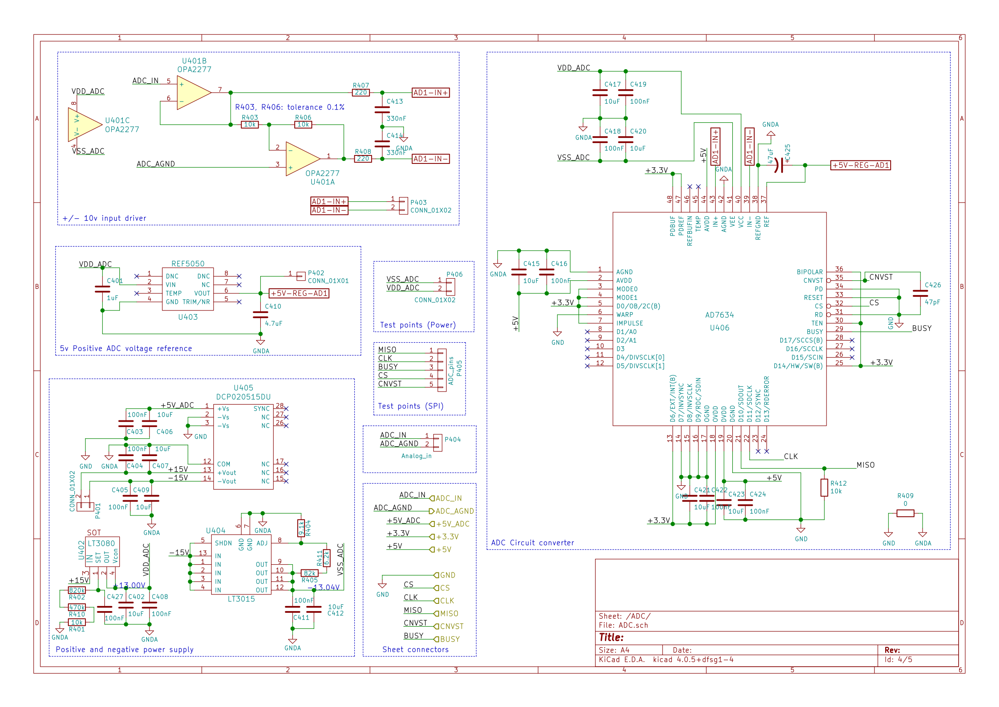 

  - Digital I/O

  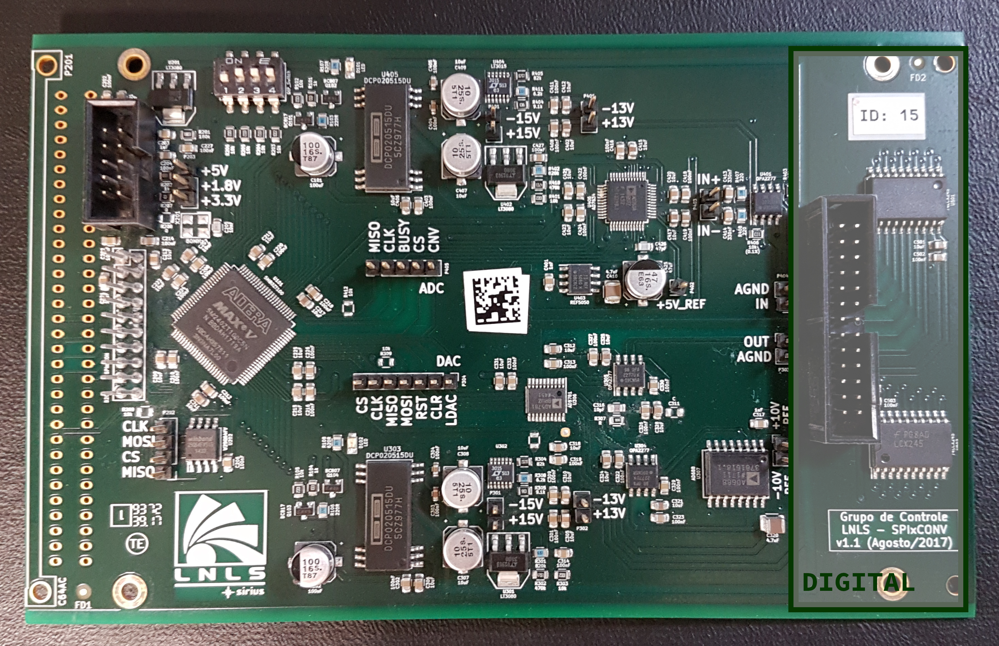
   

<!--====================-->
#### PCB
<!--====================-->

  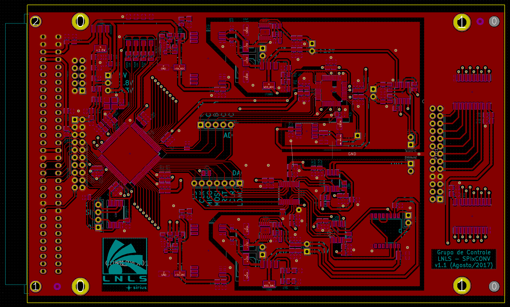 
  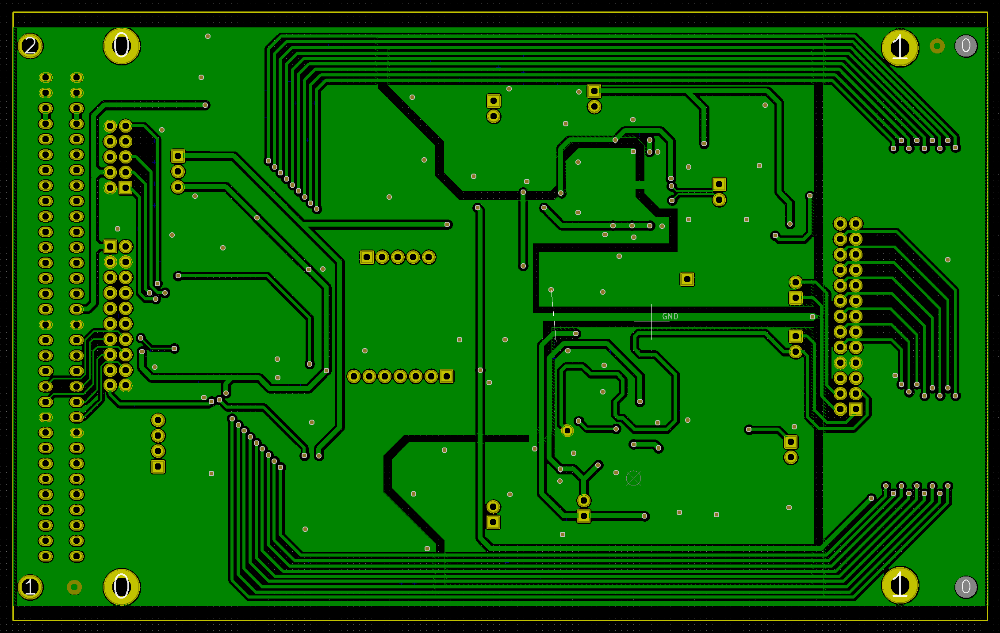

<!--====================-->
#### Connectors
<!--====================-->

  - SPIxxCON

  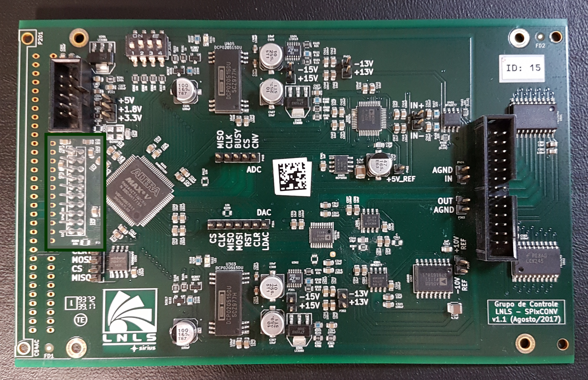 
  

  - CPLD

  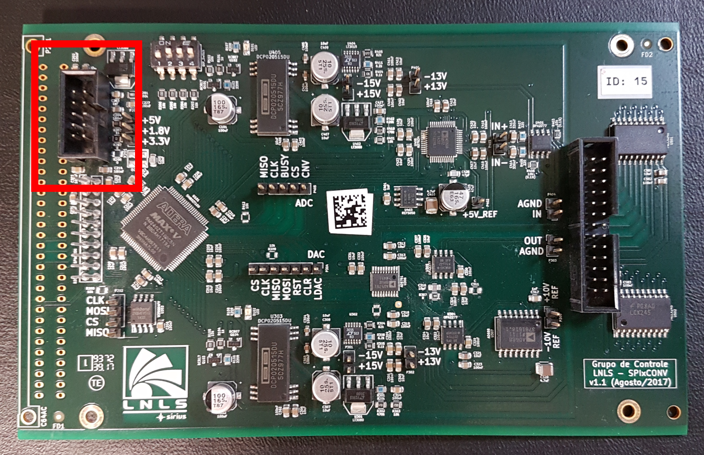 
  

  - Board Connection Link

   
  
  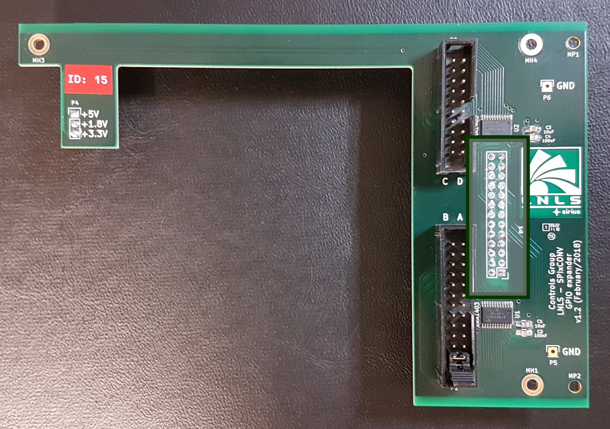

<!--==============================-->
### GPIO Expander Board
<!--==============================-->

<!--====================-->
#### Circuit
<!--====================-->
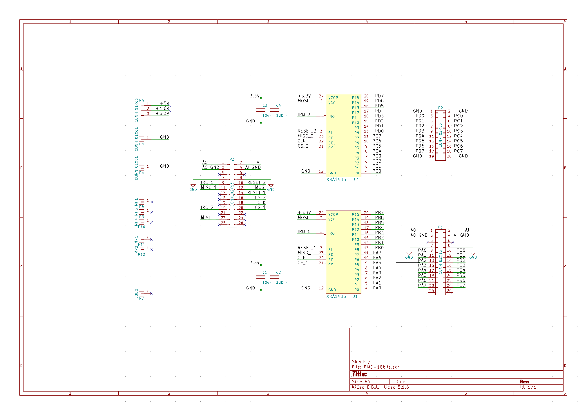

<!--====================-->
#### PCB
<!--====================-->

   
  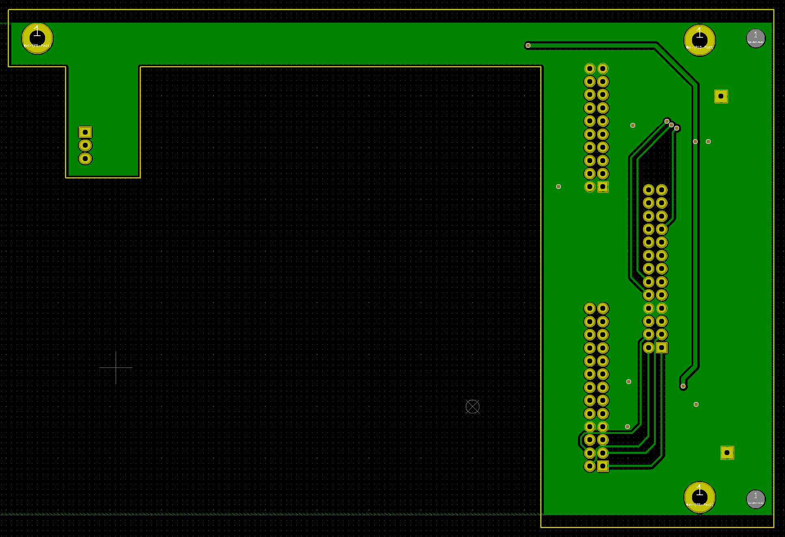

<!--====================-->
#### Connectors
<!--====================-->

  - Interface A/B

   
  

  - Interface C/D

   
  

<!--====================-->
#### BOM
<!--====================-->
Bill of materials

<!--====================-->
#### Identification
<!--====================-->

  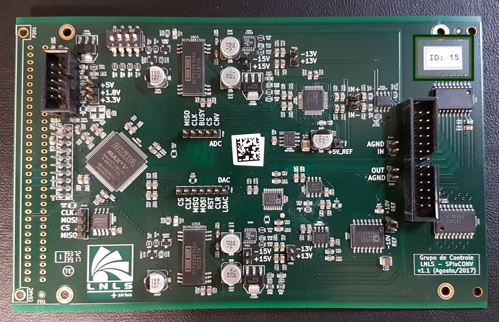 
  

<!--========================================-->
### Software
<!--========================================-->

The software files of this project related to the server-side (IOC) is now available at [streamdevice-ioc](https://github.com/lnls-sirius/streamdevice-ioc) GitHub's repository under the "spixconv" directory.

The software files related to the OPI (Operator Interface) is now at [pydm-opi](https://github.com/lnls-sirius/pydm-opi) GitHub's repository.

Finally, the client-side (Python code) is at this repository under the [scripts](https://github.com/lnls-sirius/SPIxCONV/tree/master/software/scripts) directory.

<!--====================-->
#### Brief Description
<!--====================-->
To remotely control the board an [EPICS](https://epics-controls.org/about-epics/) IOC with an OPI was developed.

The IOC was built using [asynDriver](https://epics.anl.gov/modules/soft/asyn/) and [StreamDevice](http://epics.web.psi.ch/software/streamdevice/) on top of it. The application is launched in a form of a Docker container. The Docker image can be found at [Docker Hub](https://hub.docker.com/repository/docker/lnlscon/streamdevice-ioc) with the tag "SPIxCONV" followed by the version (eg: SPIxCONV-v1.9.6).

To configure the parameters of the IOC a [spreadsheet](https://cnpemcamp.sharepoint.com/:x:/s/controle/EUG0_4JUaz9Au7kZNcMZwZQB1x5OJBN_1QMdbbCGJ1Driw?e=Po8LNr) is used (available for CNPEM accounts only). PV's prefix, Power Supply voltage, host IP to connect to, scan rate and other settings can be adjusted. 

<!--====================-->
#### OPI (Operator Interface)
<!--====================-->

Previously, [Control System Studio](http://controlsystemstudio.org/) was used to develop the OPI. The windows can still be found under the [CSS](https://github.com/lnls-sirius/SPIxCONV/tree/master/software/CSS) directory. Lately, we have been using [PyDM (Python Display Manager)](https://slaclab.github.io/pydm/) to develop the windows. As stated before, the files related to the PyDM OPI is located in [pydm-opi](https://github.com/lnls-sirius/pydm-opi) repository.

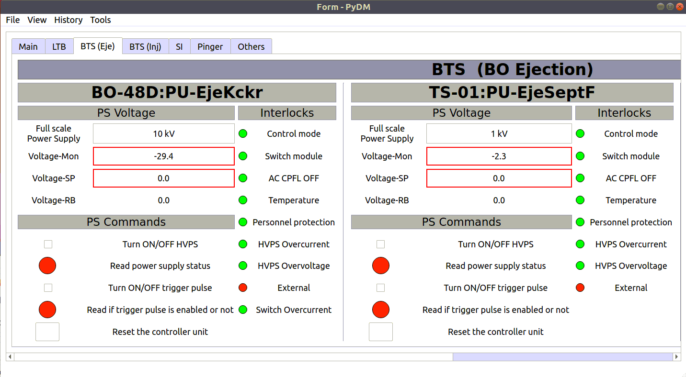

<!--====================-->
#### CPLD
<!--====================-->

<!--====================-->
#### Code
<!--====================-->
[https://lnls-sirius.github.io/SPIxCONV/](https://lnls-sirius.github.io/SPIxCONV/)

<!--========================================-->
### Known Problems
<!--========================================-->

<!--========================================-->
### FAQ
<!--========================================-->

